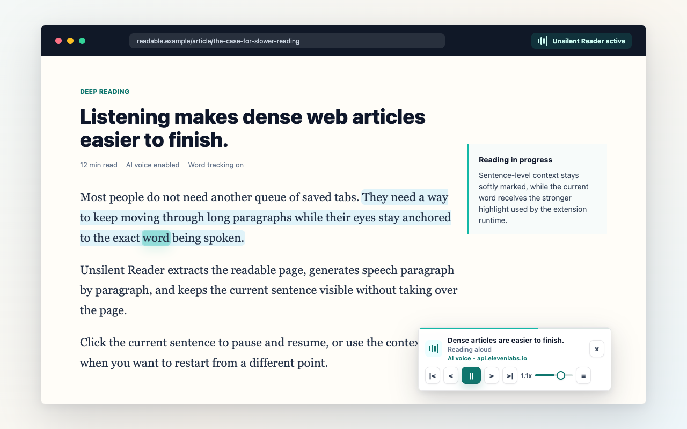
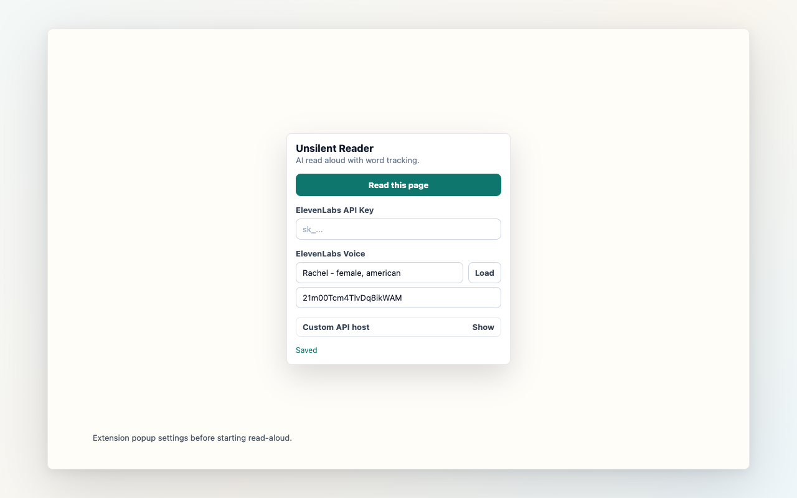

# Unsilent Reader

Unsilent Reader 是一个 Chrome 扩展，可以把可阅读网页变成专注的朗读体验：AI 语音朗读、单词高亮、按段生成、本地 TTS 缓存，以及精确的单词/句子跳转。

扩展可以直接在浏览器中使用用户自己的 ElevenLabs API key，也可以配置兼容的自定义 API host，适合私有部署或团队共享额度。

English documentation: [README.md](README.md).

## 安装

从 Chrome Web Store 安装 Unsilent Reader：

[**添加到 Chrome**](https://chromewebstore.google.com/detail/unsilent-reader/ihkmfdcpgjalneedeknedemoaghojhbl)

安装后：

1. 打开一个可阅读的网页。
2. 点击浏览器工具栏里的 Unsilent Reader 扩展图标。
3. 配置 ElevenLabs API key，或填写兼容的自定义 API host。
4. 点击 “Read this page” 启动页面上的悬浮朗读播放器。

## 界面展示



Unsilent Reader 会在当前网页中加入一个紧凑的悬浮播放器。朗读到的单词会在原文中高亮，播放器支持播放/暂停、句子跳转、单词跳转、语速控制和请求检查。



截图由 [store-assets/showcase.html](store-assets/showcase.html) 渲染生成：

```bash
node scripts/render-store-assets.mjs
```

渲染脚本默认使用本机 Chrome channel。如果你的 Playwright 环境使用的是自带 Chromium，可以设置 `UNSILENT_PLAYWRIGHT_CHANNEL=chromium`。

## 功能

- 从当前标签页提取可阅读内容并朗读。
- 使用 ElevenLabs 或兼容的自定义 API host 生成 AI 语音。
- 朗读时同步高亮单词。
- 点击页面中的单词即可跳转到对应位置。
- 通过悬浮播放器按句子或单词导航。
- 在本地缓存生成过的语音，减少重复请求。
- AI 语音不可用时回退到浏览器内置语音引擎。
- 在悬浮播放器中检查最近的 TTS 请求和缓存命中情况。

## 仓库结构

```text
.
├── components/              扩展共享 React UI
├── configs/                 扩展设置和语音预设
├── entrypoints/             WXT 扩展入口
├── features/                页面提取和朗读运行时
├── public/                  扩展图标
├── server/                  可选的 Next.js 自定义 API host
└── store-assets/            Chrome Web Store 文案和截图
```

## 环境要求

- Node.js 20 或更新版本
- pnpm 10
- Chrome 或其他 Chromium 浏览器，用于本地扩展测试
- 可选：ElevenLabs API key，用于 AI 语音

## 扩展开发

安装依赖：

```bash
pnpm install
```

运行扩展开发构建：

```bash
pnpm dev
```

在 Chrome 中加载生成的未打包扩展目录：

```text
.output/chrome-mv3-dev
```

构建和打包：

```bash
pnpm compile
pnpm build
pnpm zip
```

打包后的 Chrome 扩展 zip 会生成在 `.output/` 目录下。

## AI 语音设置

最简单的设置方式是直接使用 ElevenLabs：

1. 打开扩展弹窗。
2. 输入你的 ElevenLabs API key。
3. 加载语音，或选择一个预设语音。
4. 保存设置。
5. 在可阅读页面上开始朗读。

API key 会保存在浏览器本地扩展存储中。它不会被提交到这个仓库，也不应该被分享。

## 可选自定义 API Host

Unsilent Reader 可以使用自定义 API host，而不是直接访问 ElevenLabs。这适用于私有部署、共享额度或抽象不同语音服务提供商。

该 host 需要实现：

```text
POST /api/tts_reading
```

请求体：

```json
{
  "text": "Text to read aloud",
  "language": "en"
}
```

期望响应：

```json
{
  "ok": true,
  "audioBase64": "base64-encoded audio",
  "mimeType": "audio/mpeg",
  "alignment": {
    "characters": ["H", "i"],
    "character_start_times_seconds": [0, 0.1],
    "character_end_times_seconds": [0.1, 0.2]
  }
}
```

## 后端开发

可选后端位于 `server/`。

安装后端依赖：

```bash
pnpm --dir server install
```

从示例文件创建本地环境文件：

```bash
cp .env.example .env.local
cp server/.env.example server/.env.local
```

在 `server/.env.local` 中设置 `ELEVENLABS_API_KEY`，然后运行：

```bash
pnpm backend
```

本地后端运行在 `http://localhost:3000`。扩展设置会清理 localhost API host，避免把本地默认值意外发布给用户。

后端检查：

```bash
pnpm --dir server typecheck
pnpm --dir server build
```

## 数据和隐私

Unsilent Reader 只会在用户主动开始网页朗读后处理页面文本。

- 直接使用 ElevenLabs 时，页面文本会发送给 ElevenLabs 生成语音。
- 使用自定义 API host 时，页面文本会发送给用户配置的 host。
- 扩展会把设置、用户提供的 ElevenLabs API key、选中的 voice ID 和语音缓存数据保存在浏览器扩展存储中。
- 可选后端不会有意持久化提交的页面文本或生成的音频，只做临时请求处理。
- 项目不包含分析统计或广告代码。

当前后端部署对应的隐私政策页面：

```text
https://unsilent-reader-server.vercel.app/privacy
```

## 控制方式

- 点击页面中被高亮/可阅读的任意单词，跳转到该单词。
- `Left` / `Right`：上一句或下一句。
- `Shift + Left` / `Shift + Right`：上一个或下一个单词。
- 使用悬浮播放器中的 bug 按钮检查 TTS 请求和缓存命中。

## Chrome Web Store 素材

商店文案和截图保存在 `store-assets/`。这些文件用于让审核包可复现，但本地开发不依赖它们。

## 安全

不要提交真实 API key 或部署 token。本地密钥请使用 `.env.local` 文件，托管部署密钥请使用 Vercel 环境变量。

如果发现安全漏洞，请查看 [SECURITY.md](SECURITY.md)。

## 贡献

欢迎贡献。请查看 [CONTRIBUTING.md](CONTRIBUTING.md)，了解本地设置、检查命令和 pull request 要求。

## 许可证

MIT. 见 [LICENSE](LICENSE)。
